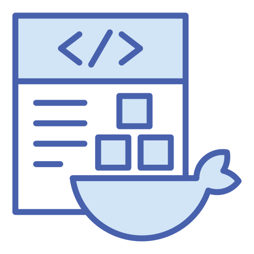

<!-- Improved compatibility of back to top link: See: https://github.com/othneildrew/Best-README-Template/pull/73 -->
<a name="readme-top"></a>
<!--
*** Thanks for checking out the Best-README-Template. If you have a suggestion
*** that would make this better, please fork the repo and create a pull request
*** or simply open an issue with the tag "enhancement".
*** Don't forget to give the project a star!
*** Thanks again! Now go create something AMAZING! :D
-->


<!-- PROJECT SHIELDS -->
<!--
*** I'm using markdown "reference style" links for readability.
*** Reference links are enclosed in brackets [ ] instead of parentheses ( ).
*** See the bottom of this document for the declaration of the reference variables
*** for contributors-url, forks-url, etc. This is an optional, concise syntax you may use.
*** https://www.markdownguide.org/basic-syntax/#reference-style-links
-->
[![Contributors][contributors-shield]][contributors-url]
[![Forks][forks-shield]][forks-url]
[![Stargazers][stars-shield]][stars-url]
[![Issues][issues-shield]][issues-url]
[![MIT License][license-shield]][license-url]


<!-- PROJECT LOGO -->
<br />
<div align="center">
  <a href="https://github.com/n3ddu8/ubuntu-base">
    
  </a>

<h3 align="center">Ubuntu Base</h3>

  <p align="center">
    An Ubuntu 22.04 container base image.
    <br />
    <br />
    <a href="https://github.com/n3ddu8/ubuntu-base/issues/new?labels=bug&template=bug-report---.md">Report Bug</a>
    ·
    <a href="https://github.com/n3ddu8/ubuntu-base/issues/new?labels=enhancement&template=feature-request---.md">Request Feature</a>
  </p>
</div>


<!-- TABLE OF CONTENTS -->
<details>
  <summary>Table of Contents</summary>
  <ol>
    <li>
      <a href="#about-the-project">About The Project</a>
      <ul>
        <li><a href="#built-with">Built With</a></li>
      </ul>
    </li>
    <li>
      <a href="#getting-started">Getting Started</a>
      <ul>
        <li><a href="#prerequisites">Prerequisites</a></li>
        <li><a href="#installation">Installation</a></li>
      </ul>
    </li>
    <li><a href="#usage">Usage</a></li>
    <li><a href="#contributing">Contributing</a></li>
    <li><a href="#license">License</a></li>
    <li><a href="#acknowledgments">Acknowledgments</a></li>
  </ol>
</details>


<!-- ABOUT THE PROJECT -->
## About The Project

An Ubuntu:22.04 container image with basic tooling:
* curl
* Python3
* Pip for Python3
* Microsoft ODBC driver 17 for working with SQL Server

### Built With

* [Docker](https://www.docker.com/)

<p align="right">(<a href="#readme-top">back to top</a>)</p>


<!-- GETTING STARTED -->
## Getting Started

### Prerequisites

* Docker, Podman or compatible container platform
  * [Get Docker](https://docs.docker.com/get-docker/)
  * [Get Podman](https://podman.io/docs/installation)

### Installation

```sh
docker build .
```

```sh
podman build .
```

<p align="right">(<a href="#readme-top">back to top</a>)</p>


<!-- USAGE EXAMPLES -->
## Usage

While this container can be launched locally using the instructions above, it is really meant to be used as a base image for downstream workflows. For instance, to use it as a base in a new Dockerfile add the line:
```sh
FROM ghcr.io/n3ddu8/ubuntu-base:nightly
```

<p align="right">(<a href="#readme-top">back to top</a>)</p>


<!-- CONTRIBUTING -->
## Contributing

Contributions are what make the open source community such an amazing place to learn, inspire, and create. Any contributions you make are **greatly appreciated**.

If you have a suggestion that would make this better, please fork the repo and create a pull request. You can also simply open an issue with the tag "enhancement".
Don't forget to give the project a star! Thanks again!

1. Fork the Project
2. Create your Feature Branch (`git checkout -b feature/AmazingFeature`)
3. Commit your Changes (`git commit -m 'Add some AmazingFeature'`)
4. Push to the Branch (`git push origin feature/AmazingFeature`)
5. Open a Pull Request

<p align="right">(<a href="#readme-top">back to top</a>)</p>


<!-- LICENSE -->
## License

Distributed under the MIT License. See `LICENSE.txt` for more information.

<p align="right">(<a href="#readme-top">back to top</a>)</p>


<!-- ACKNOWLEDGMENTS -->
## Acknowledgments

* [Docker icons created by Afian Rochmah Afif - Flaticon](https://www.flaticon.com/free-icons/docker)

<p align="right">(<a href="#readme-top">back to top</a>)</p>


<!-- MARKDOWN LINKS & IMAGES -->
<!-- https://www.markdownguide.org/basic-syntax/#reference-style-links -->
[contributors-shield]: https://img.shields.io/github/contributors/n3ddu8/ubuntu-base.svg?style=for-the-badge
[contributors-url]: https://github.com/n3ddu8/ubuntu-base/graphs/contributors
[forks-shield]: https://img.shields.io/github/forks/n3ddu8/ubuntu-base.svg?style=for-the-badge
[forks-url]: https://github.com/n3ddu8/ubuntu-base/network/members
[stars-shield]: https://img.shields.io/github/stars/n3ddu8/ubuntu-base.svg?style=for-the-badge
[stars-url]: https://github.com/n3ddu8/ubuntu-base/stargazers
[issues-shield]: https://img.shields.io/github/issues/n3ddu8/ubuntu-base.svg?style=for-the-badge
[issues-url]: https://github.com/n3ddu8/ubuntu-base/issues
[license-shield]: https://img.shields.io/github/license/n3ddu8/ubuntu-base.svg?style=for-the-badge
[license-url]: https://github.com/n3ddu8/ubuntu-base/blob/master/LICENSE.txt
